# multiespectral_acquire

## Architecture Overview

**New Simplified Architecture** - Publisher/Subscriber pattern with centralized recording control.

```mermaid
graph TB
    subgraph "Camera Handlers (C++)"
        VIS[Basler Handler<br/>basler_camera_handler]
        LWIR[FLIR Handler<br/>flir_camera_handler]
    end
    
    subgraph "LIDAR Processing (C++)"
        PC_CROP[PointCloud Crop<br/>pointcloud_crop_node]
        IMG_CROP[Image Crop Nodes<br/>image_crop_node x4]
    end
    
    subgraph "Buffer Handlers (Python)"
        BUF_VIS[Buffer Visible<br/>buffer_handler_node.py]
        BUF_LWIR[Buffer LWIR<br/>buffer_handler_node.py]
        BUF_RANGE[Buffer Range<br/>buffer_handler_node.py]
        BUF_REFLEC[Buffer Reflectivity<br/>buffer_handler_node.py]
        BUF_SIGNAL[Buffer Signal<br/>buffer_handler_node.py]
        BUF_NEARIR[Buffer Near-IR<br/>buffer_handler_node.py]
        BUF_PC[Buffer PointCloud<br/>buffer_handler_node.py]
        BUF_GNSS[Buffer GNSS<br/>buffer_handler_node.py]
        BUF_ODOM[Buffer Odom<br/>buffer_handler_node.py]
    end
    
    subgraph "External Sensors"
        OUSTER[/Ouster LIDAR<br/>points + 4 images/]
        GPS[/GNSS/]
        ODO[/Odometry/]
    end
    
    subgraph "Recording Control"
        CTRL[/Multiespectral/recording_enabled<br/>std_msgs/Bool/]
        GUI[Web GUI<br/>Flask + SocketIO]
    end
    
    VIS -->|visible_camera/image_with_metadata| BUF_VIS
    VIS -.->|Master trigger| BUF_LWIR
    VIS -.->|Master trigger| BUF_RANGE
    VIS -.->|Master trigger| BUF_REFLEC
    VIS -.->|Master trigger| BUF_SIGNAL
    VIS -.->|Master trigger| BUF_NEARIR
    VIS -.->|Master trigger| BUF_PC
    VIS -.->|Master trigger| BUF_GNSS
    VIS -.->|Master trigger| BUF_ODOM
    
    LWIR -->|lwir_camera/image_with_metadata| BUF_LWIR
    
    OUSTER -->|/ouster/points| PC_CROP
    OUSTER -->|/ouster/range_image| IMG_CROP
    OUSTER -->|/ouster/reflec_image| IMG_CROP
    OUSTER -->|/ouster/signal_image| IMG_CROP
    OUSTER -->|/ouster/nearir_image| IMG_CROP
    
    PC_CROP -->|points_cropped| BUF_PC
    IMG_CROP -->|range_image_cropped| BUF_RANGE
    IMG_CROP -->|reflec_image_cropped| BUF_REFLEC
    IMG_CROP -->|signal_image_cropped| BUF_SIGNAL
    IMG_CROP -->|nearir_image_cropped| BUF_NEARIR
    
    GPS -->|/gnss/fix| BUF_GNSS
    ODO -->|/odometry/filtered| BUF_ODOM
    
    GUI -->|Publish Bool| CTRL
    CTRL -.->|Enable/Disable| BUF_VIS
    CTRL -.->|Enable/Disable| BUF_LWIR
    CTRL -.->|Enable/Disable| BUF_RANGE
    CTRL -.->|Enable/Disable| BUF_REFLEC
    CTRL -.->|Enable/Disable| BUF_SIGNAL
    CTRL -.->|Enable/Disable| BUF_NEARIR
    CTRL -.->|Enable/Disable| BUF_PC
    CTRL -.->|Enable/Disable| BUF_GNSS
    CTRL -.->|Enable/Disable| BUF_ODOM
    
    BUF_VIS -->|PNG + YAML| DISK_VIS[(visible/)]
    BUF_LWIR -->|PNG + YAML| DISK_LWIR[(lwir/)]
    BUF_RANGE -->|PNG + YAML| DISK_RANGE[(range/)]
    BUF_REFLEC -->|PNG + YAML| DISK_REFLEC[(reflec/)]
    BUF_SIGNAL -->|PNG + YAML| DISK_SIGNAL[(signal/)]
    BUF_NEARIR -->|PNG + YAML| DISK_NEARIR[(nearir/)]
    BUF_PC -->|BIN + YAML| DISK_PC[(PointCloud/)]
    BUF_GNSS -->|YAML| DISK_GNSS[(gnss/)]
    BUF_ODOM -->|YAML| DISK_ODOM[(odom/)]
    
    style VIS fill:#a8d5ff
    style LWIR fill:#a8d5ff
    style PC_CROP fill:#a8d5ff
    style IMG_CROP fill:#a8d5ff
    style CTRL fill:#ffcc99
    style GUI fill:#ffcc99
```



**Key Features:**
- **Publisher/Subscriber pattern**: Camera handlers publish, buffer handlers store
- **Centralized recording control**: Single Bool topic controls all storage nodes
- **Master-triggered sync**: All sensors synchronized with visible camera as master
- **Generic buffer handler**: Works with any ROS message type using `rospy.AnyMsg`
- **Flexible storage**: PNG (images), YAML (metadata), BIN (pointclouds)
- **No rosbags**: Direct file storage for easier data management
- **Auto store_all**: If no master_topic specified, stores all incoming data
- **Session management**: One folder per execution, created on first recording enable
- **Modular architecture**: Separate launch files for LIDAR crop and buffer handlers

### Ouster LIDAR Images

The Ouster driver publishes 4 different image representations from the same point cloud scan:

| Image Type | Topic | Content | Use Case |
|------------|-------|---------|----------|
| **Range** | `/ouster/range_image` | Distance to each point (depth map) | 3D reconstruction, obstacle detection |
| **Reflectivity** | `/ouster/reflec_image` | Intensity of laser return | Material classification, lane marking detection |
| **Signal** | `/ouster/signal_image` | Photon count (signal strength) | Signal quality assessment, filtering |
| **Near-IR** | `/ouster/nearir_image` | Ambient near-infrared light | Passive imaging, illumination estimation |

All images are organized as 2D arrays matching the LIDAR's scanning pattern (e.g., 1024×64 for OS1-64), where:
- **Width**: Horizontal resolution (azimuth samples)
- **Height**: Vertical resolution (elevation channels)

These images are cropped by FOV (configurable angular or pixel ranges) using `image_crop_node` and stored alongside the cropped point cloud for multimodal analysis.

## Dependencies

Note that due to licensing issues no conde from Pylon or Spinnaker is uploaded here. Both libraries need to be installed. 
As for pylon, autogenerated wrapper for this camera is used (generated by pylon software).

# PTP synchronization

Camera timestamps are synchronized with PTP, to do so a PTP daemon needs to be running on the OBC.

```sh
    sudo apt install linuxptp
    ethtool -T eth0 # Check if output supports PTP software or hardware or both
```

Setup as master in `/etc/linuxptp/ptp4l.conf`:
```sh
[global]
# Define as master
gmCapable 1
# Interval of Sync messages
logSyncInterval 1
# Interval announce messages
logAnnounceInterval 1
# Interval Delay_Req messages
logMinDelayReqInterval 0
```

Run the PTP service and synchronize system clock :)
(in the robot intefaces are enp1s0 and enp2s0)
```sh
sudo ptp4l -i enp1s0 -m -S -f /etc/linuxptp/ptp4l.conf
sudo phc2sys -c CLOCK_REALTIME -s enp1s0 -w -m
sudo ptp4l -i enp2s0 -m -S -f /etc/linuxptp/ptp4l.conf
sudo phc2sys -c CLOCK_REALTIME -s enp2s0 -w -m

```

## Usage

Launch the complete multiespectral acquisition system:

```bash
# Easy way: Use helper script with automatic timestamp
./src/multiespectral_acquire/scripts/launch_with_timestamp.sh

# Or manually specify session folder
roslaunch multiespectral_acquire multiespectral_launch.launch session_folder:="27-01-2026_10h30m"

# With custom parameters
./src/multiespectral_acquire/scripts/launch_with_timestamp.sh \
    dataset_output_path:=/custom/path \
    output_frame_rate:=2
```

**Control recording via topic:**
```bash
# Enable recording (creates folder on first enable)
rostopic pub /Multiespectral/recording_enabled std_msgs/Bool "data: true"

# Disable recording (keeps folder for next enable)
rostopic pub /Multiespectral/recording_enabled std_msgs/Bool "data: false"
```

**Or use the Web GUI:**
```bash
# Start the GUI (from multiespectral_acquire_gui package)
roslaunch multiespectral_acquire_gui multiespectral_gui_launch.launch

# Access at http://localhost:5000
# - Click "Start Acquisition" to enable recording (badge turns green "RECORDING")
# - Click "Stop Acquisition" to disable recording (badge turns gray "IDLE")
# - View live camera feeds (LWIR, RGB, and SWIR if LIDAR available)
# - Monitor frame rates and image counts in real-time
```

**GUI Features:**
- ✅ Real-time recording status indicator (4 states: IDLE, RECORDING REQUESTED, RECORDING, STOP REQUESTED)
- ✅ Live camera preview synced at master rate (shows exactly what's being stored)
- ✅ Dynamic LIDAR visibility (shows/hides based on topic availability)
- ✅ Frame rate monitoring reflects actual storage rate
- ✅ Image counter per sensor
- ✅ Responsive layout (landscape/portrait modes)

**Note:** GUI subscribes to `_sync` topics, so images only appear when recording is active and data is being synchronized/stored.

**Output structure:**
```
/home/administrator/images_eeha/27-01-2026_10h30m/
├── visible/
│   ├── 0000001.png
│   ├── 0000001.yaml
│   └── ...
├── lwir/
│   ├── 0000001.png
│   ├── 0000001.yaml
│   └── ...
├── swir/
├── PointCloud/
│   ├── 0000001.bin
│   ├── 0000001.yaml
│   └── ...
├── gnss/
│   ├── 0000001.yaml
│   └── ...
└── odom/
    ├── 0000001.yaml
    └── ...
```

**Important notes:**
- Default session_folder is "session" - manually specify timestamp when launching
- Helper script `launch_with_timestamp.sh` generates timestamp automatically
- Storage folder is created **once** when recording is first enabled
- Same folder is reused across enable/disable cycles during execution

## Testing

Both launch files execute correctly:

```bash
# Test main acquisition system
roslaunch multiespectral_acquire multiespectral_launch.launch session_folder:="test"

# Test GUI control interface (requires ROS master running)
roslaunch multiespectral_acquire_gui multiespectral_gui_launch.launch
# Access GUI at http://localhost:5000
```

**Expected output for GUI:**
- Node initialized successfully
- Publishing to `/Multiespectral/recording_enabled`
- Flask app serving on port 5000
- Warning about LIDAR topic if acquisition system not running (normal)


## GUI Configuration

The GUI is now **generic and configurable** via ROS parameters. You can customize camera names and topics:

### Multiespectral Setup (Default)
```xml
<!-- Default camera assignments -->
<arg name="gui_title" default="Multiespectral Camera GUI" />
<arg name="camera1_topic" default="/Multiespectral/lwir_camera/image_with_metadata_sync" />
<arg name="camera1_name" default="LWIR Camera" />
<arg name="camera2_topic" default="/Multiespectral/visible_camera/image_with_metadata_sync" />
<arg name="camera2_name" default="Visible Camera" />
```

### Fisheye Setup
```bash
# Launch fisheye acquisition with buffers
roslaunch multiespectral_acquire fisheye_launch.launch session_folder:="my_fisheye_session"

# Launch fisheye GUI (in another terminal)
roslaunch multiespectral_acquire_gui fisheye_gui_launch.launch
# Access GUI at http://localhost:5000
```

The fisheye setup includes:
- **Frontal camera** (master at 1Hz by default)
- **Rear camera** (slave at 5Hz, synchronized to frontal)
- **Buffer handlers** for both cameras with GNSS and odometry
- **No LIDAR** processing (fisheye-specific)

### Custom Configuration
To use different cameras or names, modify the launch file arguments:

```bash
roslaunch multiespectral_acquire_gui multiespectral_gui_launch.launch \
    gui_title:="My Custom GUI" \
    camera1_topic:="/Multiespectral/thermal/image_sync" \
    camera1_name:="Thermal IR" \
    camera2_topic:="/Multiespectral/rgb/image_sync" \
    camera2_name:="RGB Camera"
```

Or create a custom launch file (see [multiespectral_gui_custom_example.launch](multiespectral_acquire_gui/launch/multiespectral_gui_custom_example.launch) or [fisheye_gui_launch.launch](multiespectral_acquire_gui/launch/fisheye_gui_launch.launch)).

The GUI will automatically:
- Display the custom title in browser tab and page header
- Subscribe to the configured camera topics
- Display the custom names in labels and titles
- Update all UI elements dynamically


## GUI control in python with VEVN

The python venv can be created inside the workspace but needs to be ignored by colcon:
```sh
    source /opt/ros/jazzy/setup.bash
    python3 -m venv .venv
    touch .venv/COLCON_IGNORE
    source .venv/bin/activate
    pip install -r /multiespectral_acquire_gui/requirements.txt
```

