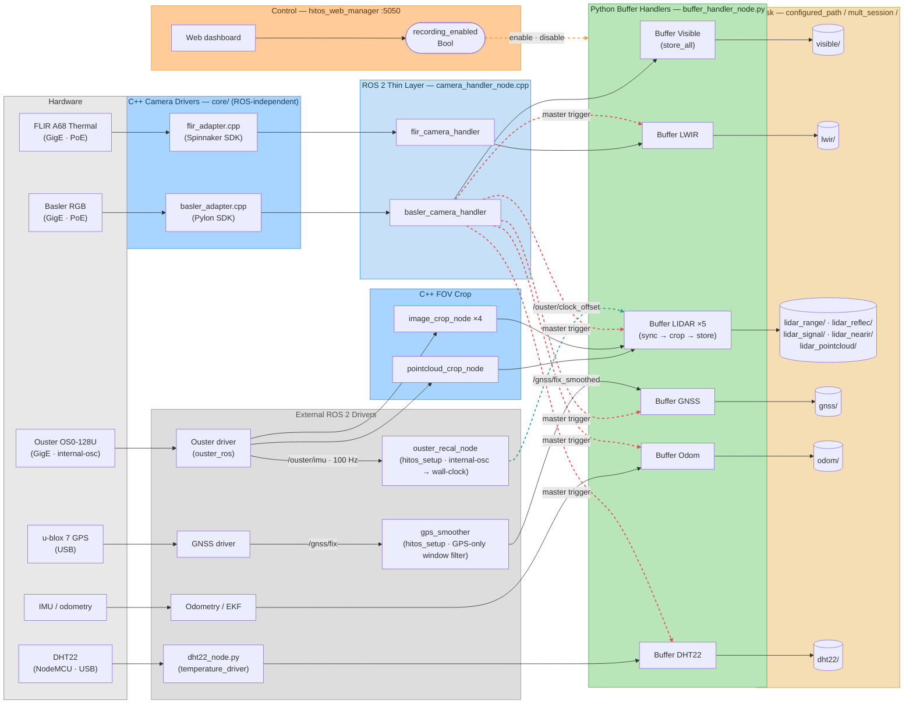
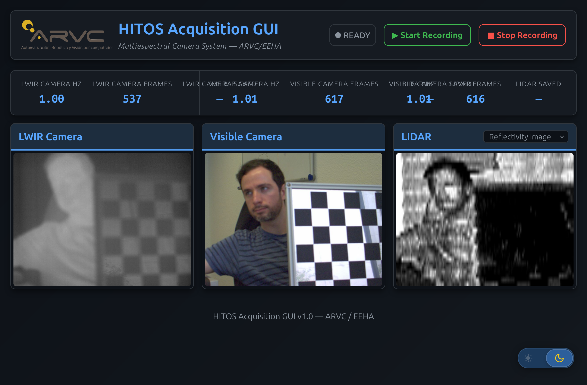
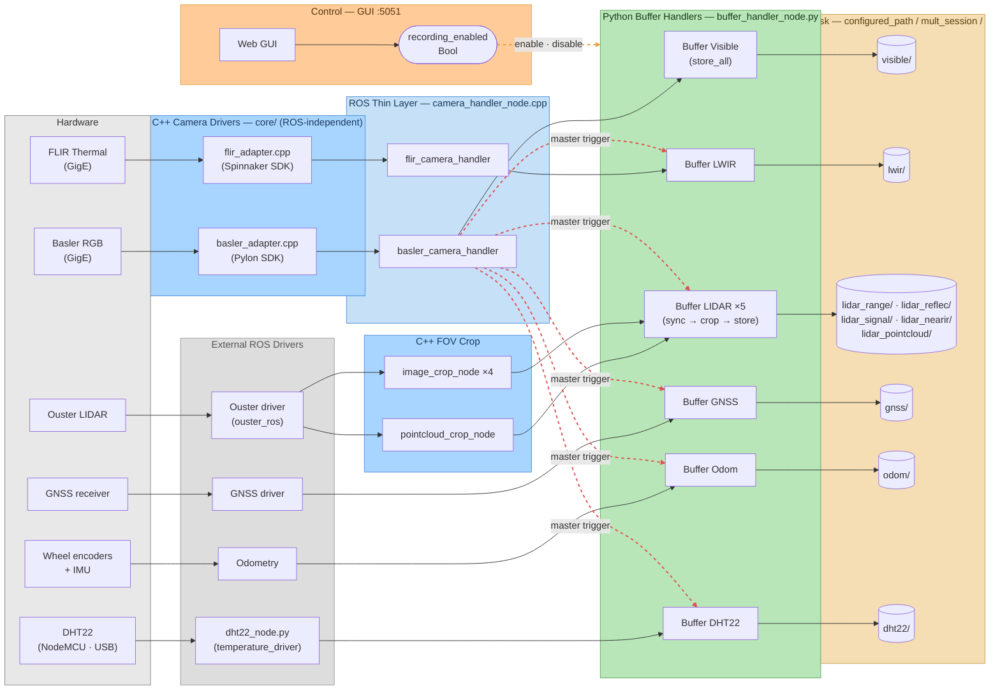
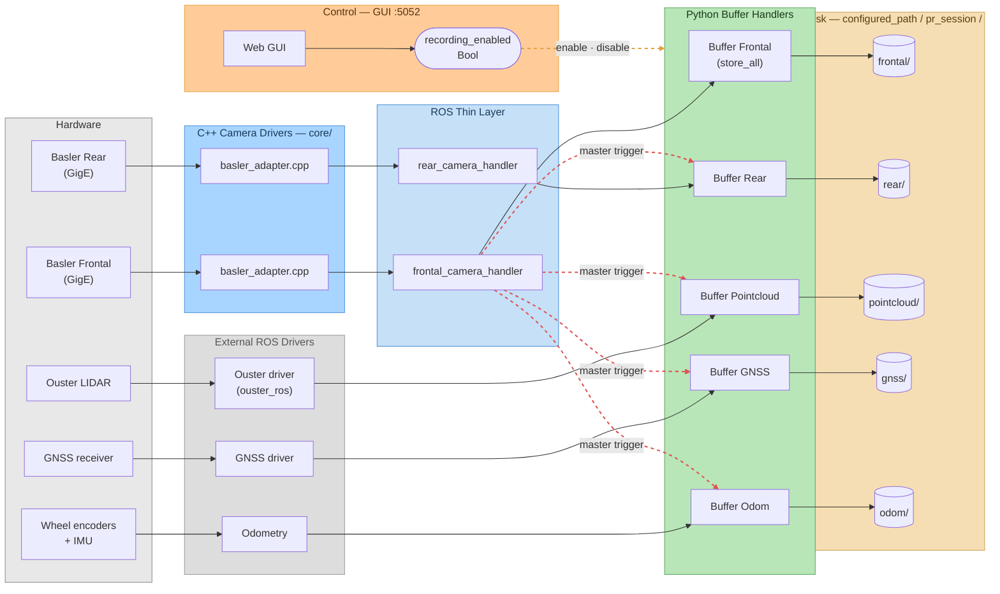

# Multiespectral Acquire

Generic metapackage for **synchronized multi-sensor data acquisition** on mobile robots. The drivers, buffer synchronization pipeline, and storage system are configurable via ROS 2 parameters and launch files — any combination of cameras and sensors can be assembled.

| Package | Description |
|---------|-------------|
| [multiespectral_acquire](multiespectral_acquire/) | Camera drivers (Basler, FLIR), timestamp synchronization, buffer/storage pipeline, FOV crop |
| [multiespectral_acquire_gui](multiespectral_acquire_gui/) | Generic Flask + SocketIO web dashboard — start/stop recording, live camera feeds, frame-rate monitoring |
| [temperature_driver](temperature_driver/) | DHT22 temperature/humidity sensor via NodeMCU (ESP8266) |

---

## HITOS deployment

This package runs on the **HITOS multiespectral payload** (Raspberry Pi 5 OBC). For hardware details — network topology, power budget, PoE wiring, PTP setup, and systemd services — see [`hitos_setup/README.md`](../hitos_setup/README.md).

Key HITOS-specific parameters:

| Parameter | Value | Reason |
|-----------|-------|--------|
| `visible_use_ptp` | `false` | Basler acA1600-60gc has no PTP; uses software `TimestampCalibration` |
| `lwir_use_ptp` | `true` | **Lock-aware**: the FLIR adapter enables PTP but verifies a real `ptpServoStatus = Locked` + UTC sanity, and falls back to software calibration if not. On this rig PTP never locks (the master is fine, the slaves don't — see `hitos_setup` → Timestamp synchronization), so the FLIR effectively runs on software calibration. |
| `dataset_output_path` | `/media/arvc/DATASETS/images_eeha` | External HDD (set by `hitos_sync.service`, the disk writer) |

**Launch files:** `multiespectral_launch.py` runs everything in one process tree
(manual use). For the systemd deployment the pipeline is split:
`cameras_only.launch.py` (Basler + FLIR, `hitos_cameras.service`) and
`capture_sync.launch.py` (lidar crop + buffer compositor,
`hitos_sync.service`). Both take the same `session_folder`; the services share
it via `/tmp/hitos_session.env`.

**Buffer compositor performance notes (2026-06):** high-rate handlers subscribe
with `raw=True` (serialized CDR bytes, parsed timestamp at a fixed offset) and
deserialize only the matched message at trigger rate; disk writes go through a
small thread pool; the process uses rclpy's `EventsExecutor`; handler nodes
disable per-node parameter services/rosout. All of this together removes the
per-message Python deserialization of the 30 Hz LWIR and 10 Hz Ouster streams
and the wait-set churn of the old MultiThreadedExecutor.

**Generic timestamp handling in `buffer_handler_node.py`** — each handler aligns its
source onto the trigger's wall-clock timescale via per-handler params (all sensor-agnostic;
the compositor just forwards them):
- `use_raw` — buffer serialized CDR bytes, read `header.stamp` at a fixed offset; deserialize
  only the matched message (~1 Hz). Avoids per-message Python deserialization.
- `stamp_from_arrival` — buffer by message arrival time instead of `header.stamp`
  (fallback for a sensor whose own stamp is unusable).
- `clock_offset_topic` — subscribe to a `std_msgs/Float64` offset (seconds) and add it to
  every stamp (buffering + republished). Used to map a free-running sensor clock to
  wall-clock. The Ouster runs `TIME_FROM_INTERNAL_OSC` (PTP won't lock on this rig) and
  `hitos_setup/ouster_recal_node` publishes `/ouster/clock_offset` (calibrated from the
  100 Hz IMU). See `hitos_setup/README.md` → "Timestamp synchronization".

**LiDAR point cloud:** the Ouster driver runs `organized: false` → a **dense** cloud
(~0.85 MB, valid points only) instead of the full 1024×128 grid (6.29 MB, 87 % zeros
outside the azimuth window). This lets the Python compositor receive the cloud at the full
10 Hz (the 6 MB organized cloud capped Python at ~5 Hz, degrading sync). Consequently
`pointcloud_crop_node` filters by the per-point **`ring` field** (beam index → elevation,
`sensor_v_fov_deg` param) rather than slicing a row/col rectangle of the (now absent) grid.

---

## Architecture — HITOS Multiespectral (ROS 2)



**Legend**: <span style="color:#4a90d9">blue</span> = C++ nodes · <span style="color:#5aa55a">green</span> = Python buffers · <span style="color:#c8a050">tan</span> = disk · <span style="color:#e6a040">orange dashed</span> = recording control · <span style="color:#e05050">red dashed</span> = master trigger · gray = external drivers / hardware

<details>
<summary>Alternative applications (ROS 1 era)</summary>

The package was originally deployed on an Ackermann/Husky robot. The architecture is identical — same driver/buffer/storage design — but without PTP or FOV crop. The GUI was a standalone Flask + SocketIO app (`multiespectral_acquire_gui`) on port 5051/5052.

### Multiespectral (Husky)


### Fisheye (Husky)


**Legend** (both diagrams): <span style="color:#4a90d9">blue</span> = C++ nodes · <span style="color:#5aa55a">green</span> = Python buffers · <span style="color:#c8a050">tan</span> = disk · <span style="color:#e6a040">orange dashed</span> = recording control · <span style="color:#e05050">red dashed</span> = master trigger · gray = external drivers / hardware

</details>

---

## Quick Start

On HITOS, acquisition is managed by systemd — see `hitos_setup` for service controls. For manual launch:

```bash
# Multiespectral
ros2 launch multiespectral_acquire multiespectral_launch.py session_folder:="my_session"
```

Recording control:
```bash
ros2 topic pub --once /Multiespectral/recording_enabled std_msgs/msg/Bool "data: true"
ros2 topic pub --once /Multiespectral/recording_enabled std_msgs/msg/Bool "data: false"
```

### Web GUI

In practice recording is driven from the responsive web dashboard (`multiespectral_acquire_gui`), which also shows live camera feeds and per-topic frame rates:

<p align="center">
  
</p>

See [multiespectral_acquire_gui/README.md](multiespectral_acquire_gui/README.md) for the full set of desktop and mobile screenshots (light/dark themes) and configuration.

---

## Output Structure

### Multiespectral
```
<configured_path>/mult_<session>/
├── visible/           # PNG + YAML per frame (master, all stored)
├── lwir/              # PNG + YAML (synced to visible master)
├── lidar_range/       # Cropped range depth images
├── lidar_reflec/      # Cropped reflectivity images
├── lidar_signal/      # Cropped signal strength images
├── lidar_nearir/      # Cropped near-IR images
├── lidar_pointcloud/  # BIN + YAML (cropped 3D point clouds)
├── gnss/              # YAML (GPS fixes, synced to master)
├── odom/              # YAML (odometry, synced to master)
├── dht22/             # YAML (temperature + humidity, synced to master)
├── tf_static.yaml     # Static TF tree snapshot at recording start
└── ouster_metadata.json  # Ouster sensor metadata snapshot at recording start
```

---

## Dependencies

| Library | Required by | Notes |
|---------|-------------|-------|
| [Pylon SDK](https://www.baslerweb.com/en/software/pylon/) | `basler_camera_handler` | Proprietary, install manually |
| [Spinnaker SDK](https://www.flir.com/products/spinnaker-sdk/) | `flir_camera_handler` | Proprietary, install manually |
| OpenCV | All image nodes | `apt install libopencv-dev` |

For per-package details see:
- [multiespectral_acquire/README.md](multiespectral_acquire/README.md) — drivers, timestamp calibration, buffer synchronization, crash recovery
- [multiespectral_acquire_gui/README.md](multiespectral_acquire_gui/README.md) — web dashboard for recording control and live monitoring
- [temperature_driver/README.md](temperature_driver/README.md) — DHT22 sensor setup

---

<details>
<summary>Historical architecture diagrams (original Husky + Fisheye deployments)</summary>

The package was originally deployed on an Ackermann/Husky robot with a different sensor suite. The architecture is analogous to HITOS — same driver/buffer/storage design — but without PTP or FOV crop.

### Multiespectral (Husky)



### Fisheye (Husky)



</details>
