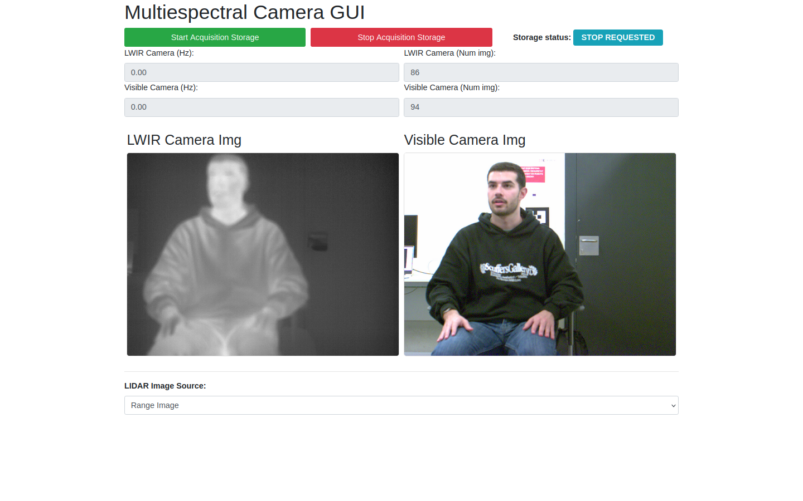
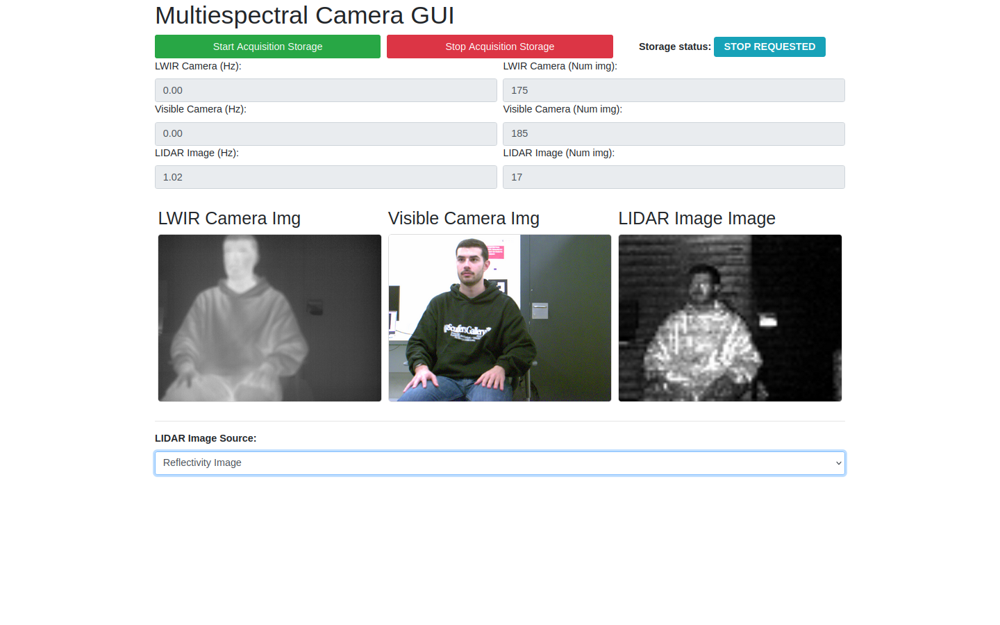
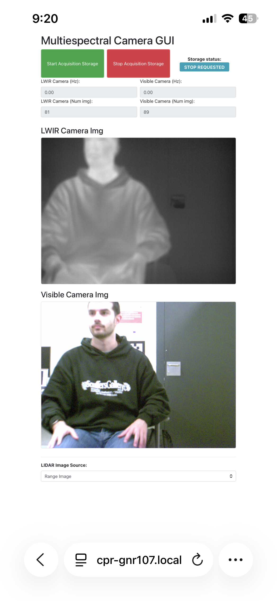
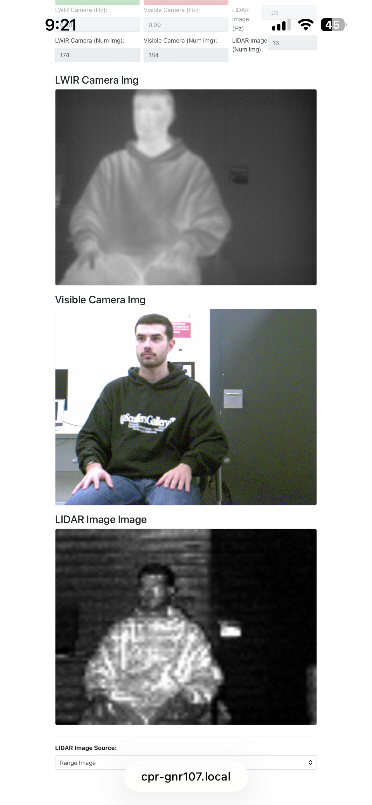

# multiespectral_acquire_gui

Generic Flask + SocketIO web interface for controlling any acquisition setup built on `multiespectral_acquire`. Camera names, topics, port and namespace are all configurable via ROS parameters in the launch file.

## Features

- Start / stop recording via `/<namespace>/recording_enabled` topic
- Live camera feeds (any two cameras + optional LIDAR)
- Real-time frame rate and image count monitoring
- Status badge (IDLE / RECORDING REQUESTED / RECORDING / STOP REQUESTED)

## Preconfigured Variants

| Variant | Port | Launch | Cameras |
|---------|------|--------|---------|
| Multiespectral | 5051 | `multiespectral_gui_launch.launch` | LWIR + Visible RGB |
| Fisheye | 5052 | `fisheye_gui_launch.launch` | Frontal + Rear |

```bash
# Multiespectral (port 5051)
roslaunch multiespectral_acquire_gui multiespectral_gui_launch.launch

# Fisheye (port 5052)
roslaunch multiespectral_acquire_gui fisheye_gui_launch.launch
```

## Screenshots (multiespectral example)

The GUI is **responsive** — adapts to desktop and mobile layouts:

<p align="center">
  
  
</p>
<p align="center">
  
  
</p>

Desktop views show cameras side-by-side with status cards; on mobile the layout stacks vertically. The LIDAR panel appears dynamically only when the topic is available.

## Dependencies

```
pip install -r requirements.txt
```

Key requirements: `flask`, `flask-socketio`, `opencv-python`, `numpy`, `pyyaml`.

## Structure

| Module | Description |
|--------|-------------|
| `multiespectral_control.py` | Main control logic (ROS ↔ Flask bridge) |
| `multiespectral_ros_ac.py` | ROS action client for acquisition commands |
| `multiespectral_dummy_ac.py` | Dummy action client for testing without hardware |
| `FreqCounter.py` | Utility for measuring topic publish rates |
| `resource/` | HTML templates, CSS, JS for the web frontend |
