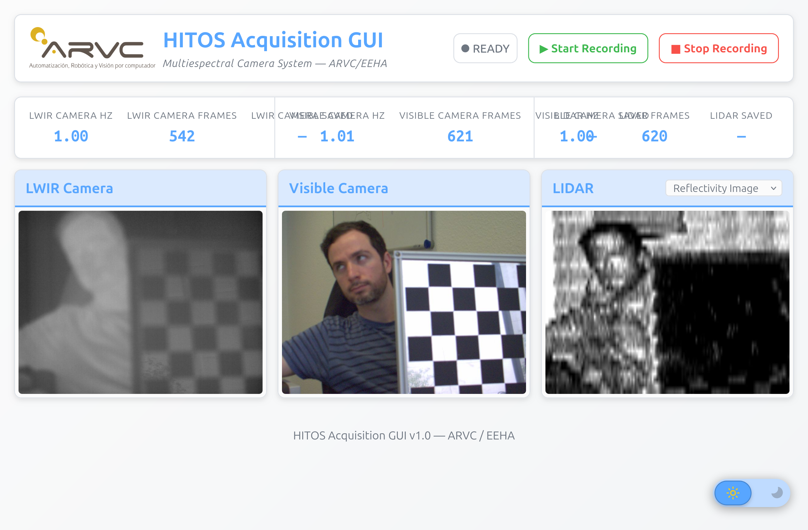
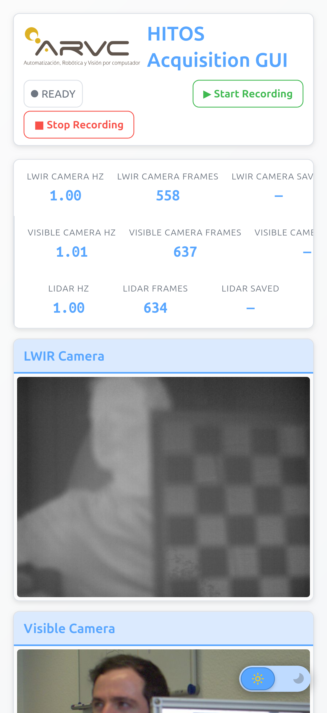
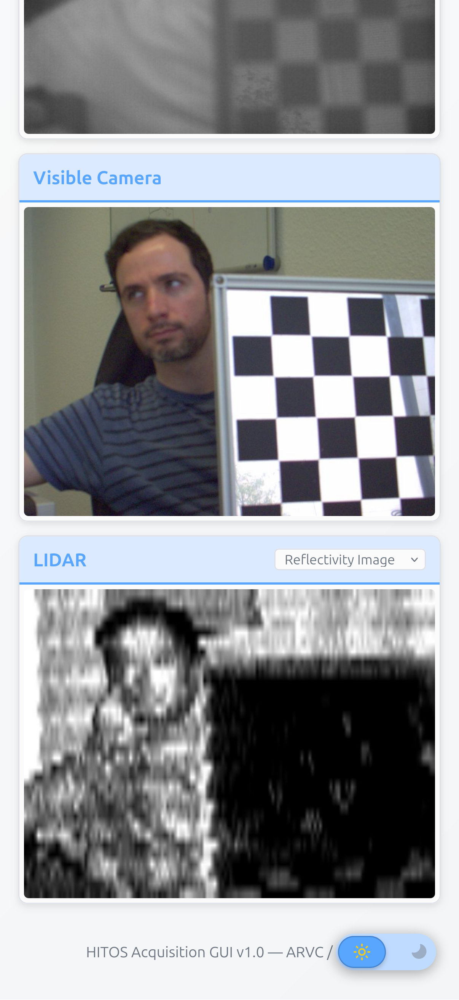
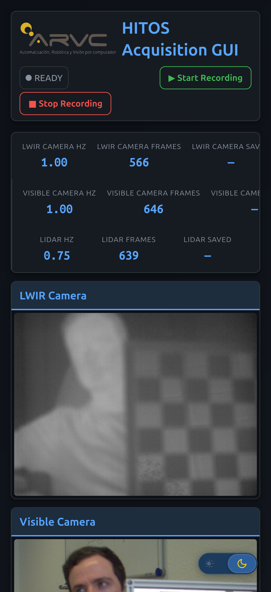
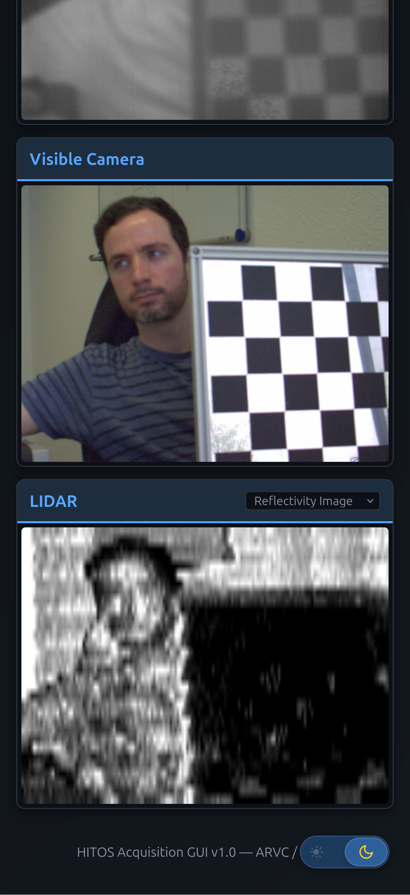

# multiespectral_acquire_gui

Generic Flask + SocketIO web interface for controlling any acquisition setup built on `multiespectral_acquire`. Camera names, topics, port and namespace are all configurable via ROS parameters in the launch file.

## Features

- Start / stop recording via `/<namespace>/recording_enabled` topic
- Live camera feeds (any two cameras + optional LIDAR)
- Real-time frame rate and image count monitoring
- Status badge (IDLE / RECORDING REQUESTED / RECORDING / STOP REQUESTED)

## Launch

The GUI is generic — camera names, topics, namespace and Flask port are all launch arguments. The package ships one launch file:

```bash
ros2 launch multiespectral_acquire_gui multiespectral_gui_launch.launch.py
```

| Argument | Default | Notes |
|----------|---------|-------|
| `flask_port` | `5000` | On HITOS the camera GUI is brought up on **5051** by `hitos_setup/camera_gui.launch.py` |
| `flask_host` | `::` | Binds all interfaces (IPv6 + IPv4) |
| camera topics / names | generic `camera1` / `camera2` placeholders | wired to the LWIR + Visible RGB sync topics at launch |

> The legacy Husky deployment also ran a "fisheye" variant (frontal + rear) on port 5052; that configuration is not part of this package.

## Screenshots (multiespectral example)

The GUI is **responsive** — adapts to desktop and mobile layouts, with light and dark themes. Desktop views show cameras side-by-side with status cards; on mobile the layout stacks vertically. The LIDAR panel appears dynamically only when the topic is available.

### Desktop

<table>
<tr>
  <th align="center">Light theme</th>
  <th align="center">Dark theme</th>
</tr>
<tr>
  <td></td>
  <td></td>
</tr>
</table>

### Mobile

<table>
<tr>
  <th colspan="2" align="center">Light theme</th>
</tr>
<tr>
  <td></td>
  <td></td>
</tr>
<tr>
  <th colspan="2" align="center">Dark theme</th>
</tr>
<tr>
  <td></td>
  <td></td>
</tr>
</table>

## Dependencies

```
pip install -r requirements.txt
```

Key requirements: `flask`, `flask-socketio`, `opencv-python`, `numpy`, `pyyaml`.

## Structure

| Module | Description |
|--------|-------------|
| `multiespectral_control.py` | Main control logic (ROS ↔ Flask bridge) |
| `multiespectral_ros_ac.py` | ROS node bridging the GUI to ROS — publishes/subscribes `recording_enabled` (`std_msgs/Bool`) and relays the camera image topics |
| `multiespectral_dummy_ac.py` | Dummy stand-in for the above, to test the GUI without hardware |
| `FreqCounter.py` | Utility for measuring topic publish rates |
| `templates/`, `static/` | HTML templates and CSS/JS for the web frontend |
